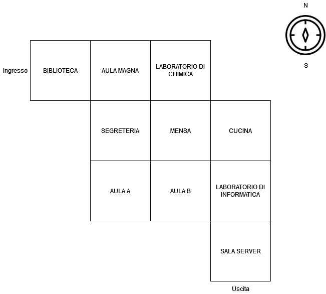

# Intro

Benvenuto in Labyrinth!
Questo gioco, scritto in Python, permette di camminare all'interno di un labirinto, all'interno del quale potrai
raccogliere oggetti, incontrare creature misteriose e sperare di riuscire a trovare l'uscita per tempo...

Sei pronto?

# Indicazioni
1. Nel laboratorio di chimica, c'è uno scienziato pazzo: questi ha prodotto una cacciavite speciale che, portato in mensa, aiuta ad aprire la cucina.
2. In segreteria c'è un mazzo di chiavi che bisogna portare nel laboratorio di informatica dal temutissimo sistemista per poter aprire la sala server.
3. Nella sala server c'è un cane a tre teste che fa la guardia all'uscita: se non gli porti un osso dall'Aula B, non ti farà uscire.
4. Nell'aula B c'è il professor Tozzi, temutissimo professore di matematica: ha bisogno che tu gli consegni il volume di Analisi I che si trova in biblioteca per poterti dare l'osso per il cane a tre teste.

Inoltre, alcune stanze sono "bloccate" fintanto che il personaggio nella stanza non ha ottenuto in regalo l'oggetto che tanto desidera...
Alcune stanze hanno gli oggetti che ti servono, dovrai solo prenderli e portarli al personaggio giusto!

# Istruzioni

Per completare il gioco, cercare all'interno del progetto tutte le righe contenenti la parola #TODO: questa indicherà lo step
necessario al completamento del gioco. 

All'inizio, le istruzioni disponibili sono ["vai", "aiuto", "fine", "direzioni"]: digita 'aiuto' per vedere
come funziona il gioco, digita 'vai' con il nome della direzione dove vorresti muoverti e 'direzioni' per scoprire quali
sono quelle disponibili. Digita 'fine' per uscire dal gioco.

Hai a disposizione 20 passi, dopodiché il gioco finirà in maniera inspiegabile... Ogni volta che ti muovi in una stanza, "consumi"
un passo. 

Ci sono delle istruzioni opzionali: servono a rendere il gioco più divertente, ma non ne compromettono la funzionalità.

